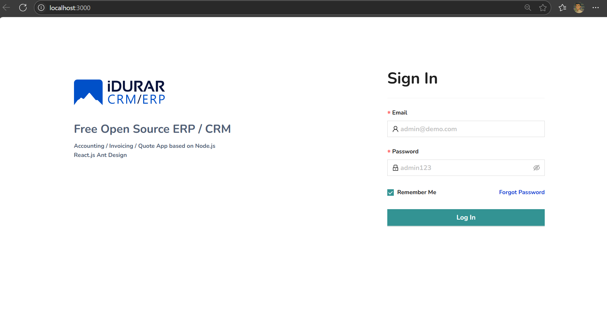
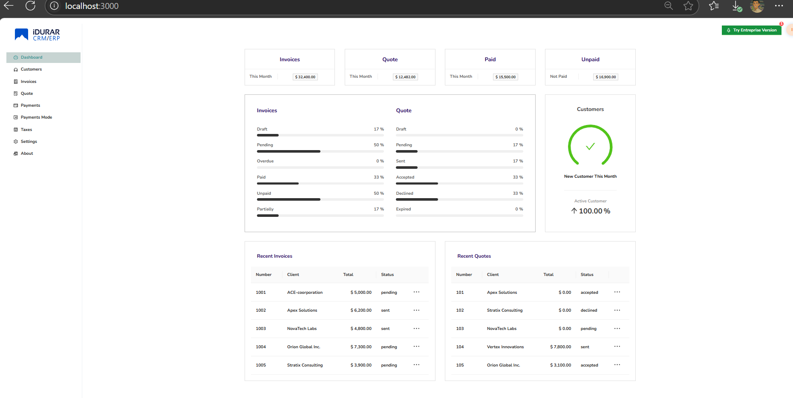
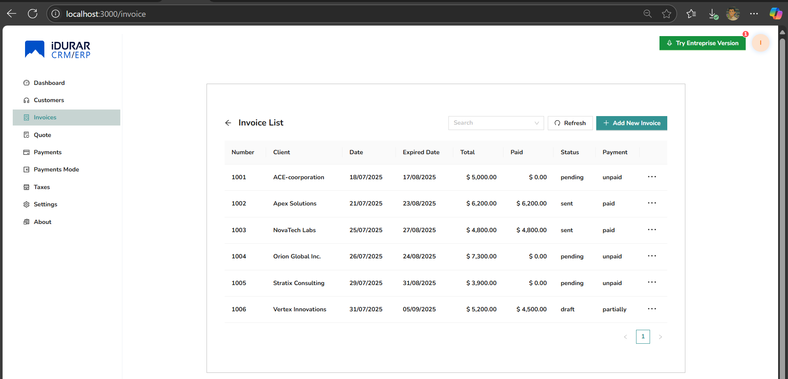
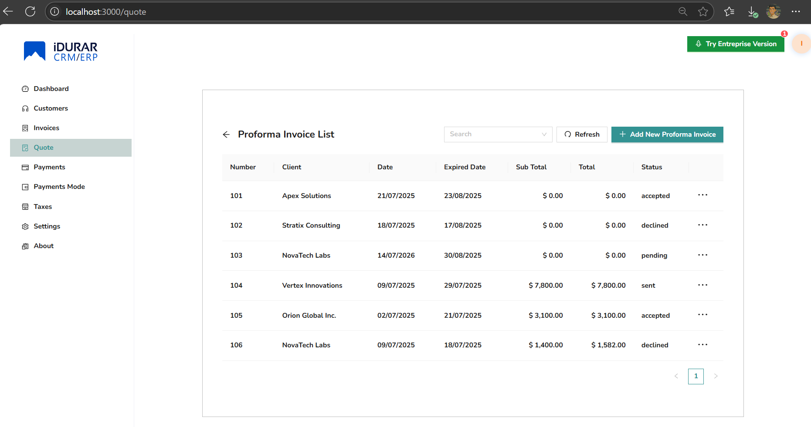
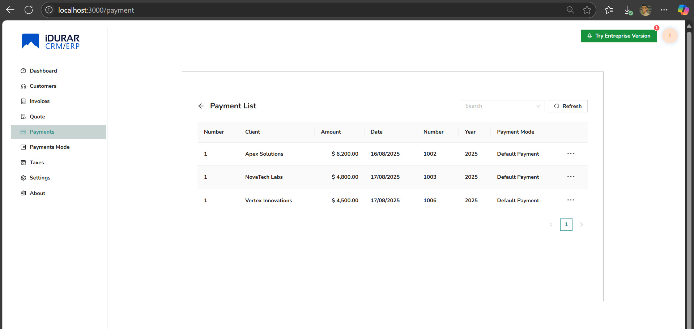
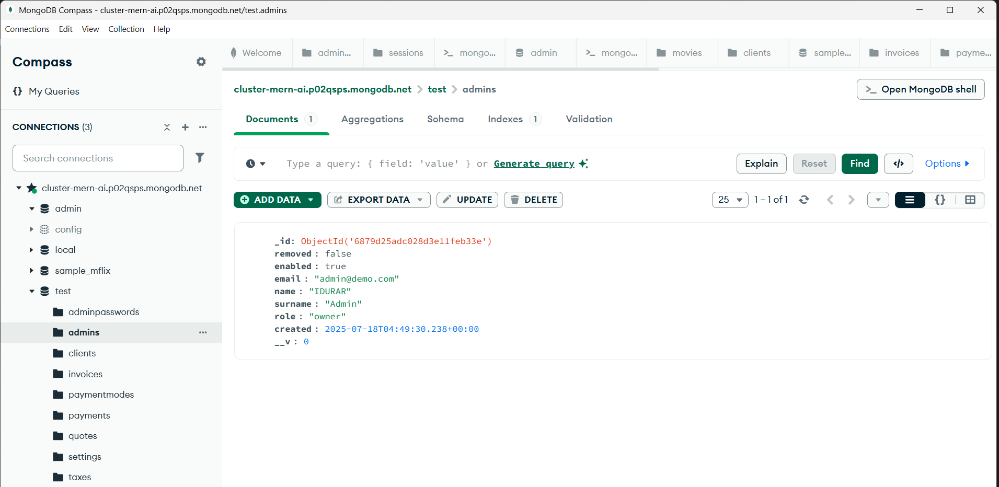
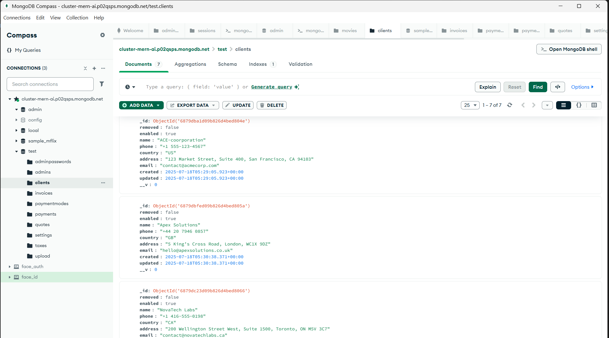
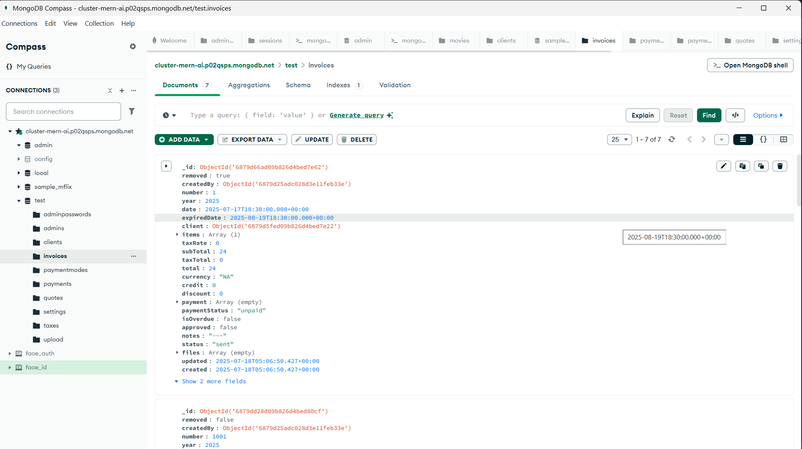
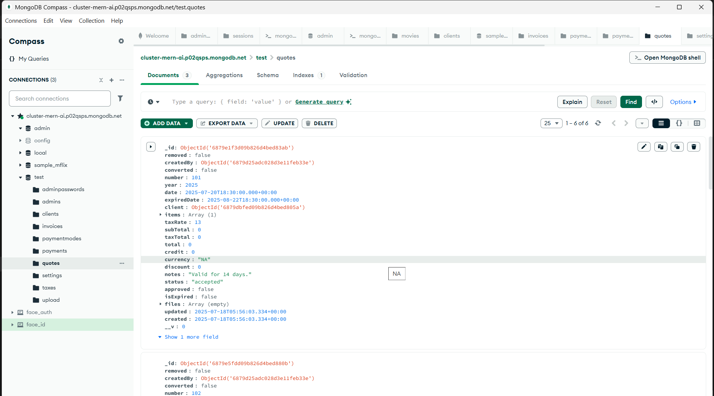
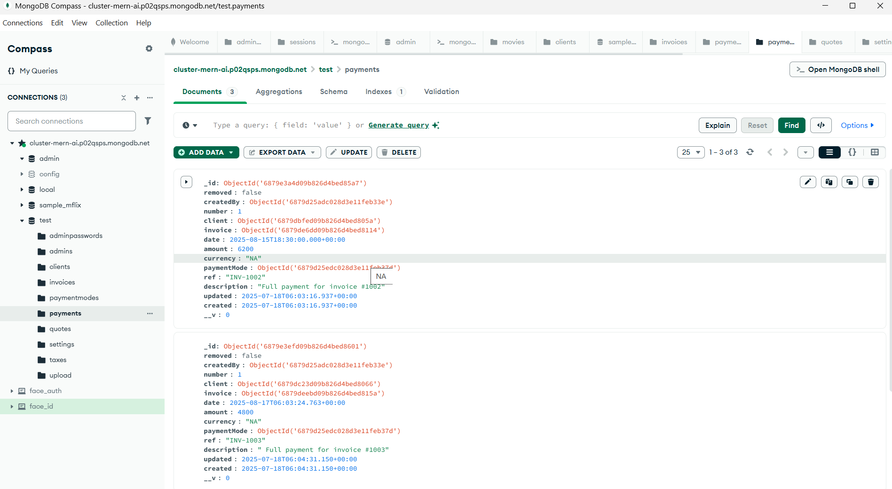

# 🚀 MERN + AI CRM Integration – Project by Fasin T S

This project is a professional implementation of a full-stack CRM based on the IDURAR ERP/CRM system, extended with AI and DevOps capabilities as part of a technical assessment.

---

## ✅ Phase 1: Environment Setup & Baseline Verification

### 📋 Tasks Completed

- Forked and cloned the base repository: `idurar-erp-crm`
- Installed backend and frontend dependencies
- Configured `.env` files
- Launched MongoDB
- Verified frontend and backend work locally
- UI and MongoDB data shown correctly

---

### 📸 Screenshots – Local Environment

#### 🔷 React Frontend UI






#### 🟢 MongoDB Compass







---

## 🛠️ Technologies Used

- React.js
- Node.js
- Express.js
- MongoDB
- Git & GitHub

---

## 🧭 How to Run Locally

### 1. Clone the repository

```bash
git clone https://github.com/fasinfasi/MERN-AI-CRM-ERP-Solution.git
```
then navigate to directory
```bash
cd MERN-AI-CRM-ERP-Solution
```

### 2. Update MongoDB URI
In the .env file, find the line that reads:
DATABASE="uri"

Replace "uri" with the actual URI of your MongoDB database.

### 3. Install Backend Dependencies & Run
In your terminal, navigate to the /backend directory
```
cd backend
```
then install dependencies:
```
npm install
```
This command will install all the required packages specified in the package.json file.

In the /backend directory of the project, execute the following command to run the setup script:

```
npm run setup
```

### 4. Install Frontend Dependencies & Run
Open a new terminal window , and run the following command to install the frontend dependencies:

```
cd ../frontend
```
then, install dependencies:
```
npm install
```
After that run the frontend:
```
npm run dev
```
After that you can see your ui on **http://localhost:3000/**  &  backend will run on **http://localhost:8888/**
