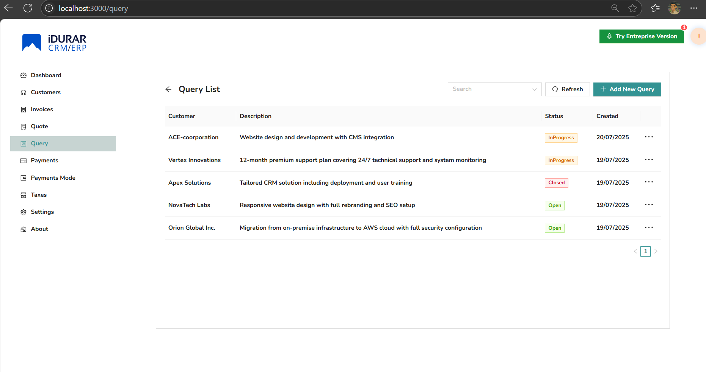
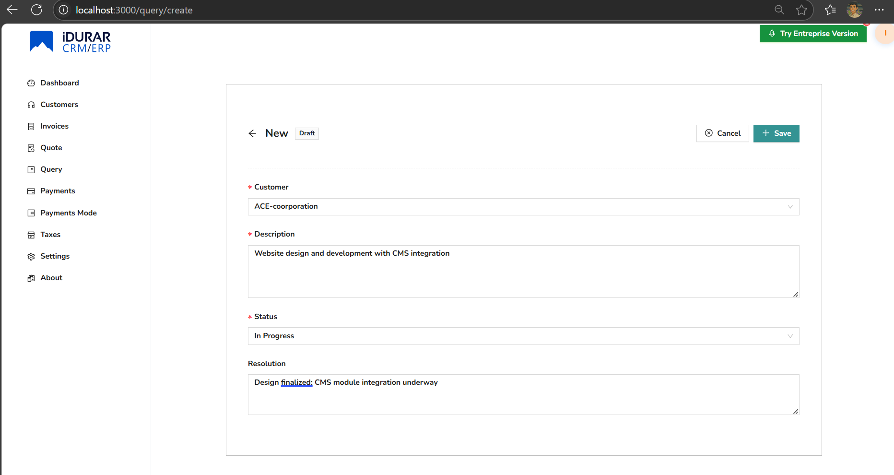
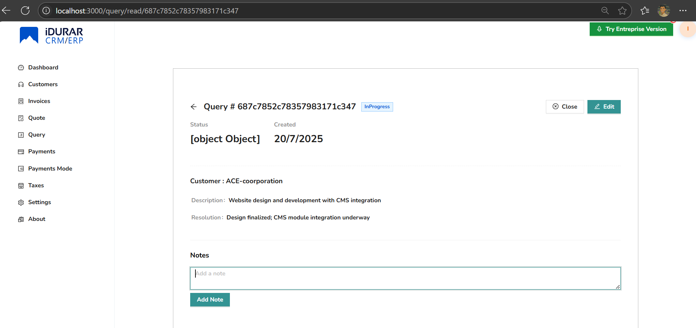
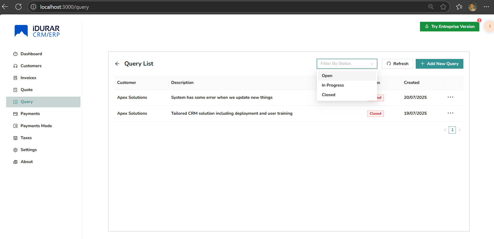
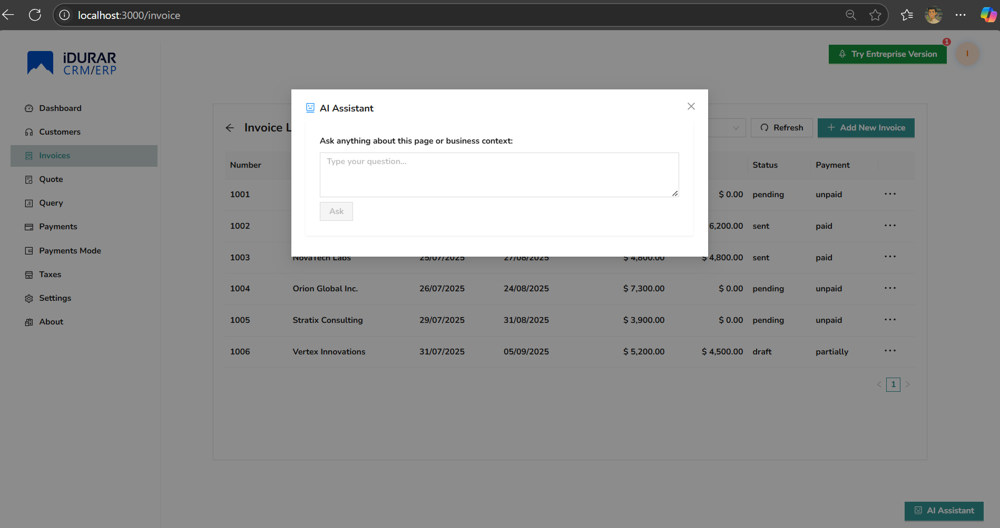
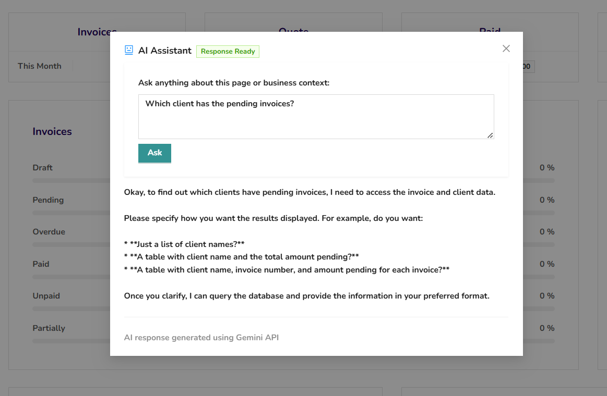
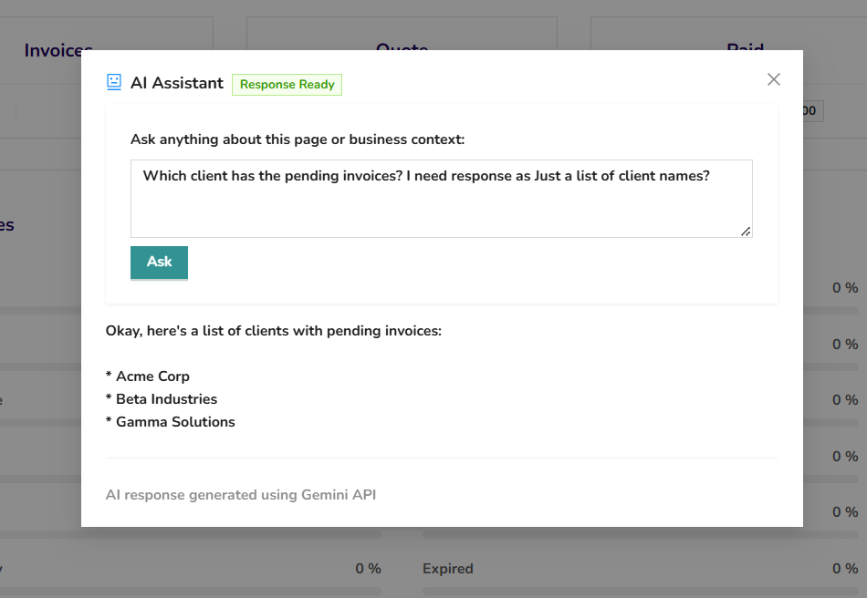
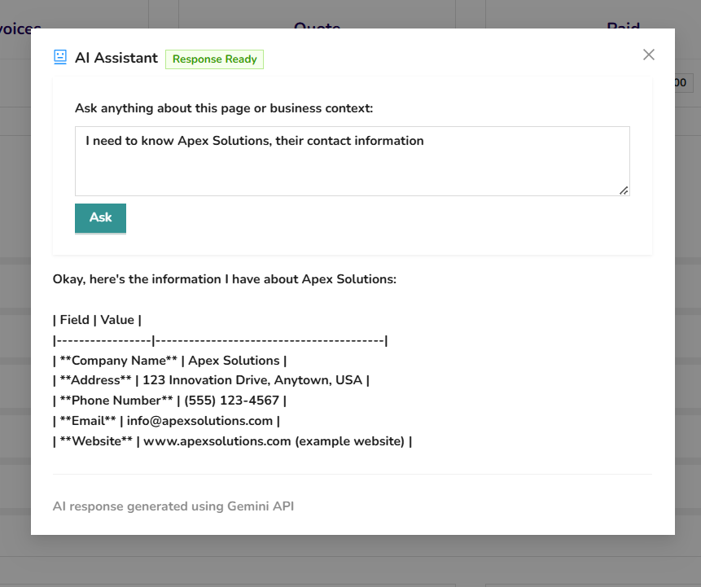
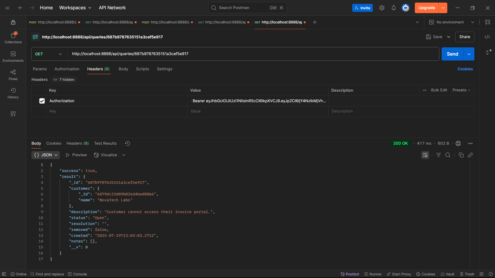
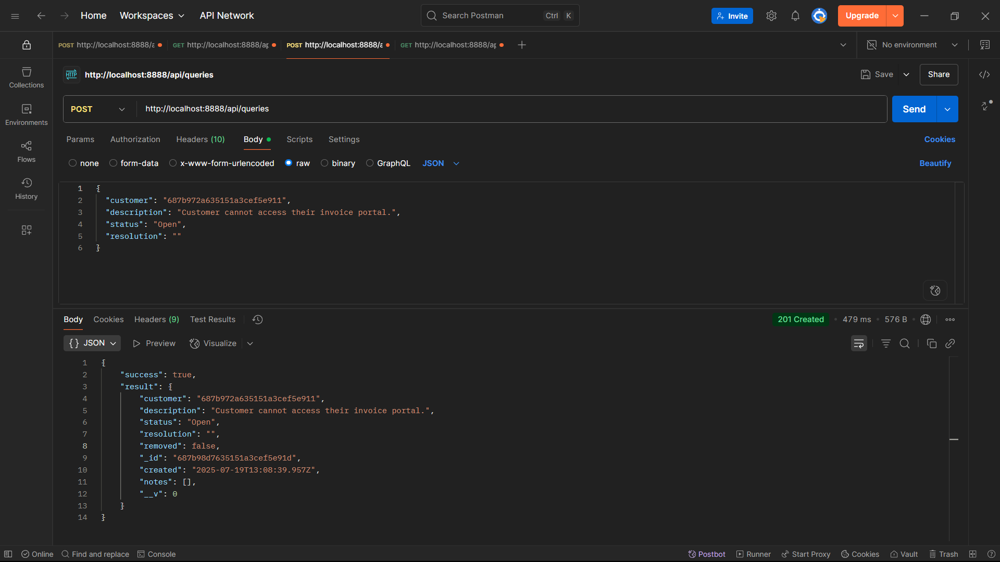

# 🚀 MERN + AI CRM Integration – Project by Fasin T S

This project is a professional implementation of a full-stack CRM based on the IDURAR ERP/CRM system, extended with AI and DevOps capabilities as part of a technical assessment.

---

## ✅ Phase 1: Environment Setup & Baseline Verification

### 📋 Tasks Completed

- Forked and cloned the base repository: `idurar-erp-crm`
- Installed backend and frontend dependencies
- Configured `.env` files
- Launched MongoDB
- Verified frontend and backend work locally
- UI and MongoDB data shown correctly

---

### 📸 Screenshots – Local Environment

#### 🔷 React Frontend UI


#### 🟢 MongoDB Compass


---

## ✅ Phase 2: Query Management Module

In this phase, a fully functional **Query Management System** was added to the existing CRM with API integration, frontend UI, and Postman-based API testing.

### 📦 Backend – `/api/queries` Endpoints

| Method | Endpoint                             | Description                                 |
|--------|--------------------------------------|---------------------------------------------|
| GET    | `/api/queries?page=1&limit=10`       | Retrieve paginated list of queries          |
| POST   | `/api/queries`                       | Create a new query                          |
| GET    | `/api/queries/:id`                   | Get a query by ID                           |
| PUT    | `/api/queries/:id`                   | Update query fields                         |
| POST   | `/api/queries/:id/notes`             | Add a note to the query                     |
| DELETE | `/api/queries/:id/notes/:noteId`     | Delete a specific note from a query         |

### 🖥️ Frontend Features (React)

#### 🔹 Query List View
- Table with the following columns:
  - Customer Name (prepopulated)
  - Description
  - Created Date
  - Status (Open/InProgress/Closed)
  - Resolution (truncated)
- Includes pagination controls and status filters

#### 🔹 Query Form
- “Add Query” form modal for creating new queries
- Edit functionality for updating status, resolution, description, etc.

#### 🔹 Notes Sub-System
- Add/Edit/Delete notes related to each query
- Notes appear contextually within the query view

### 🧪 API Testing

Five Postman tests were created and verified:

- ✅ Create query
- ✅ Retrieve all queries (paginated)
- ✅ Get single query by ID
- ✅ Update query
- ✅ Add and delete notes

> The Postman collection is available in the `/tests/` folder as `phase2-api-tests.postman_collection.json`.

---

## 🛠️ Technologies Used

- React.js
- Node.js
- Express.js
- MongoDB
- Git & GitHub
- Postman

---

### 📸 Screenshots – Local Environment
#### 🔷 React Frontend UI









#### 🟣 APIs Tested (Postman)



#### 🟢MongoDB (query data)


---

## 🧭 How to Run Locally

### 1. Clone the repository

```bash
git clone https://github.com/fasinfasi/MERN-AI-CRM-ERP-Solution.git
```
then navigate to directory
```bash
cd MERN-AI-CRM-ERP-Solution
```

### 2. Update MongoDB URI
In the .env file, find the line that reads:
DATABASE="uri"

Replace "uri" with the actual URI of your MongoDB database.

### 3. Install Backend Dependencies & Run
In your terminal, navigate to the /backend directory
```
cd backend
```
then install dependencies:
```
npm install
```
This command will install all the required packages specified in the package.json file.

In the /backend directory of the project, execute the following command to run the setup script:

```
npm run setup
```

### 4. Install Frontend Dependencies & Run
Open a new terminal window , and run the following command to install the frontend dependencies:

```
cd ../frontend
```
then, install dependencies:
```
npm install
```
After that run the frontend:
```
npm run dev
```
After that you can see your ui on **http://localhost:3000/**  &  backend will run on **http://localhost:8888/**
